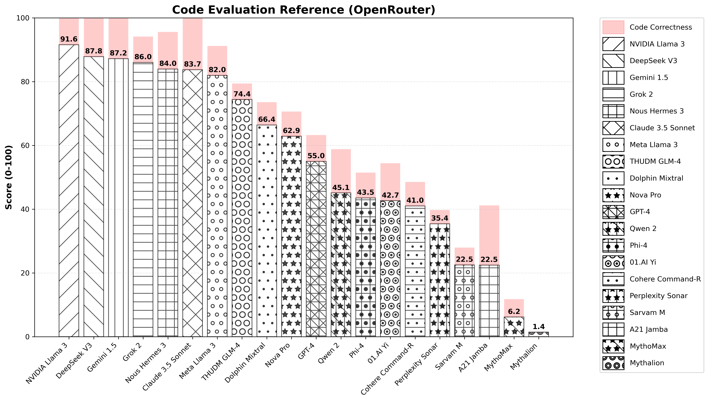
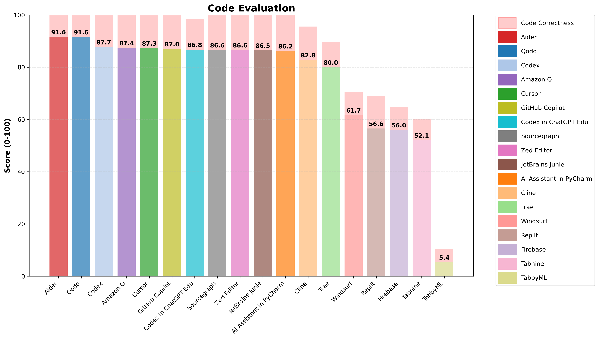

# LLM Coding Capability Assessment Framework

This repository contains a structured framework for evaluating Large Language Models' (LLMs) coding capabilities through a series of carefully designed programming challenges.

## Research Methodology

### Test Structure
Each test in this framework follows a consistent structure:
- A `prompt.txt` file containing the problem specification
- A `benchmarking.py` file implementing test cases and verification
- Solution files generated by LLMs being evaluated

### Baseline Measurement
Each problem includes a `cancre.py` (French for "dunce") that provides a minimal baseline:
- It reads the input in the correct format
- It outputs a trivial or default response without solving the problem
- For example, in sorting problems, it might output the input list unchanged
- This serves multiple purposes:
  * Provides a working example of input/output handling
  * Sets a minimal performance baseline
  * Helps verify the testing infrastructure
  * Demonstrates the expected solution format

### Data Collection Process

1. **Problem Assignment**
   - Contributors provide the content of `prompt.txt` to their assigned LLM/code assistant
   - The problem specifications are designed to test specific algorithmic and implementation capabilities
   - Each prompt includes clear input/output formats and constraints

2. **Solution Generation**
   - The LLM generates a solution based on the prompt
   - If the LLM attempts to create an application or provides a non-extractable solution, contributors may refine the prompt to ensure a clear, testable output
   - The core challenge and expected output format must remain unchanged during any prompt refinement

3. **Solution Extraction**
   - Contributors extract the LLM's solution into a Python file
   - The solution must be taken as-is from the LLM's output
   - No modifications or optimizations are allowed to the LLM's code
   - If the LLM provides multiple solutions, only the final/complete version should be used

4. **Verification**
   - Solutions are tested using the corresponding `benchmarking.py`
   - Test cases cover various edge cases and performance requirements
   - Results are automatically scored and documented

## Usage for Contributors

1. Clone this repository
2. Select a test problem directory
3. Provide the contents of `prompt.txt` to your assigned LLM/code assistant
4. Extract the LLM's solution into a new Python file in the same directory with the assistant's name

Conduct the generation in an isolated environment to prevent LLMs from accessing each other's solutions

## Usage

run generate_plot.py

